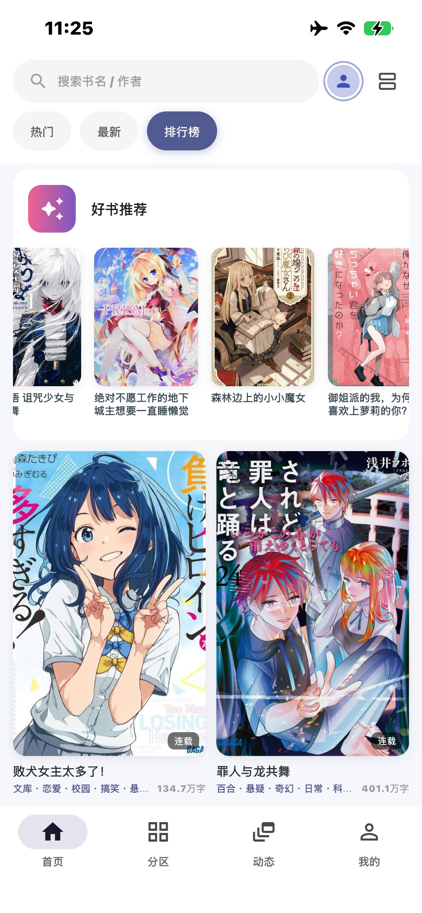
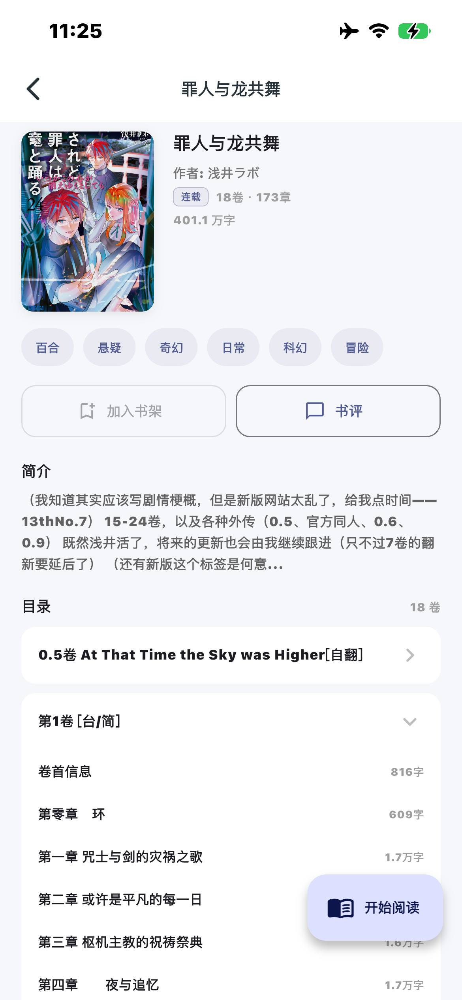
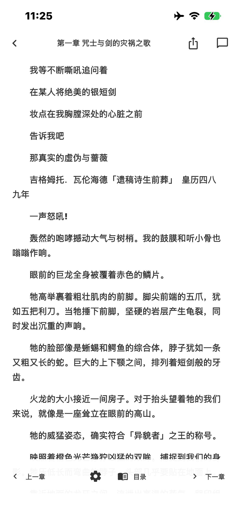

    

    <h1>Yomiru</h1>

使用 Flutter 开发的 轻之国度 第三方客户端，提供更适合手机和平板设备的阅读、书架和社区浏览体验。

  

Yomiru 是一款面向移动端设备的轻之国度第三方客户端，集小说阅读、书架管理和社区交流于一体。

- **社区**：支持动态、书评、章节讨论和访问用户主页。
- **阅读**：支持滚动/翻页阅读、目录、进度记录、正文缓存和简繁体切换。
- **个人中心**：支持用户资料、粉丝关注、作品书架、勋章中心和任务中心。
- **使用体验**：采用缓存优先和后台更新，加载速度更快，适配深色模式、平板、大屏和横屏设备。
- **操作界面**：采用统一的卡片层级，让所有界面保持一致的设计语言。布局会根据设备大小自适应调整，清晰和易于操作。
  
## 隐私与账号安全

Yomiru 是第三方客户端，用户应自行保管账号、密码、Cookie、Token 和其他登录凭据。

- 登录凭据使用系统安全存储
- 不绕过登录、权限验证或付费限制
- 受保护的内容可能需要使用拥有相应权限的账号访问
- 站点接口或页面变化可能导致部分功能暂时无法使用
- 反馈问题时请勿提交密码、Cookie、Token或其他敏感信息

## 问题反馈

遇到问题时，请先确认官网是否可以正常访问。若官网也无法访问，可能是官方服务或本地网络出现问题；若官网正常而 Yomiru 仍然异常，再通过“设置 → 反馈问题”提交反馈。

## 声明

Yomiru 是非官方第三方客户端，仅用于学习和测试。站点内容和规则可能随时变化，不保证持续可用，亦不提供任何绕过访问控制、付费机制或站点限制的功能。

本仓库用于发布 Yomiru 软件及版本更新，并开放部分独立模块的源码。

## 部分源码

[查看源码与说明](source/README.md)。

这些代码不包含站点接口、登录鉴权、网络请求实现或完整应用工程，不能直接用于构建完整的 Yomiru 安装包。

## License

This project is licensed under the MIT License. See [LICENSE](LICENSE) for details.
